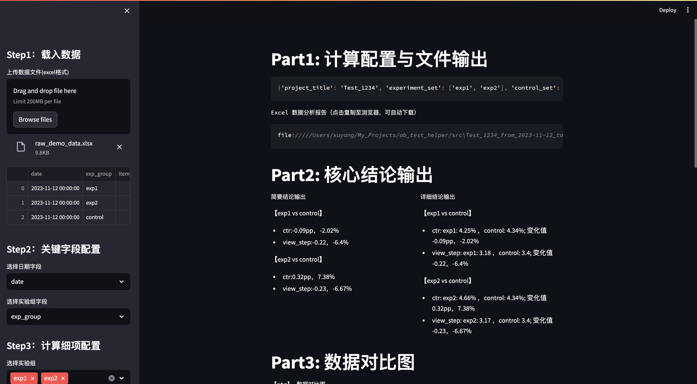
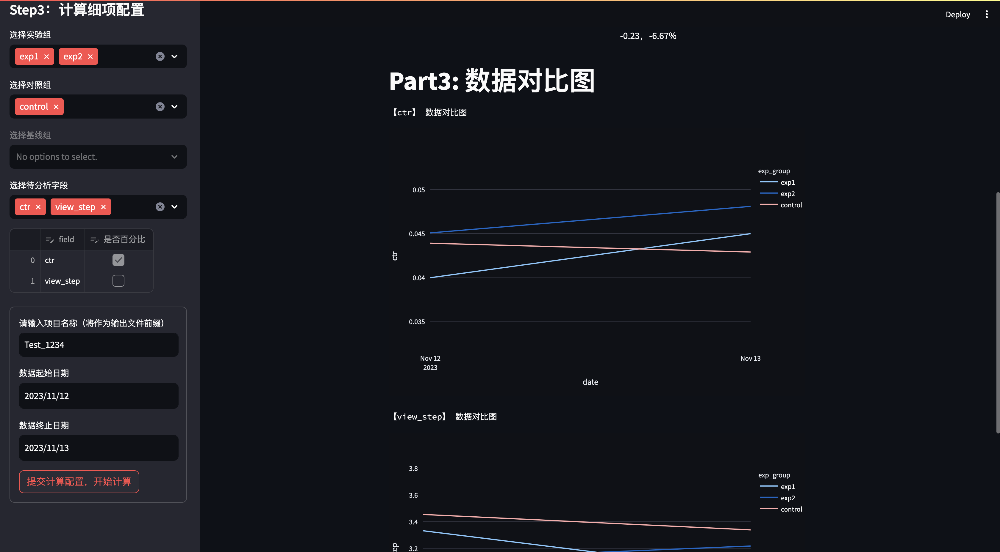

# ab_test_helper
* 这是一个分析ab实验数据，计算实验组与对照组之间各指标差异的小工具
* a little tool to analysis ab test data, calculate diff between exp and control group with several convinent utilities
* 如果你正在管理多个ab实验，不得不利用excel手动计算实验数据，这个工具可以帮你摆脱很多枯燥的工作
* if you are managing tons of ab testing and have to calculate the result with excel, this tool may get you rid of lots of boring work
* 如果你有新的想法，欢迎与我联系。
* have fun and if you have any new idea please tell me!




## how to run
* you can run it with 
```
cd to src folder
streamlit run ab_app_streamlit.py
```
* else you can just run
```
cd to src folder
python3 main.py
```
* else if you are using mac and are familiar with bash, you can set an alias in your bashprofile or other, here i will use .zshrc
```
alias ab_test_helper="streamlit run abs/path/to/src/ab_app_streamlit.py"
```

## calculation detail
* 本程序的输入数据是一个excel表格，每列为指标，每行为实验日期
* the input is a excel file, which may generated by sql from your ab testing platform, the format is like [raw_demo_data.xlsx](./demo/raw_demo_data.xlsx)
* the output file is like [out_demo](./demo/Test_1234_from_2023-11-12_to_2023-11-13.xlsx)
* for each compare pair like exp1 vs control:
  * 脚本会计算每个指标下，每个观测日期，实验组与对照组关注指标之间的绝对差异及相对差异
  * the script will calculate abs diff, relative diff for each day
  * 取观测日期的均值，作为本轮次实验的最终结论
  * and calculate the average of abs diff, relative diff among days as the final conclusion

## script detail
* the user interface is built on streamlit
* the calculation and out file generation is built on numpy and pandas